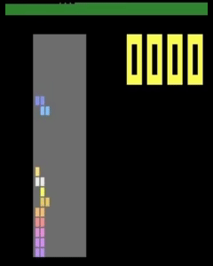
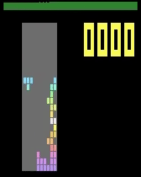
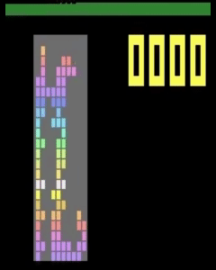
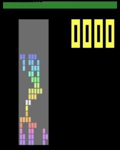

# 🎮 DQN Training Progression: Random Action Selection → Epsilon-Greedy → Custom Reward Logic

This project presents a progression of Deep Q-Learning strategies for Atari **Tetris** using the Gymnasium ALE interface.  
Across all phases, the agent uses a DQN framework — the difference lies in *how actions are chosen* and *how rewards are shaped*.

---

## **1. Phase 1 — DQN With Pure Random Action Selection (500k Episodes)**  
In the first stage, we run a full DQN pipeline but override the policy so that **all actions are chosen uniformly at random**, regardless of Q-values.

- The DQN still trains each step  
- Replay buffer fills normally  
- Q-network updates occur  
- But the *behavior policy* is **pure random sampling**, not epsilon-greedy  

This phase serves as a baseline to observe:
- How the network behaves when exploration is maximal  
- How the replay buffer fills without directed exploration  
- What raw environmental dynamics look like without guided policy behavior  

---

## **2. Phase 2 — Standard Epsilon-Greedy DQN (2M Episodes)**  
Next, we enable a standard **epsilon-greedy policy**, allowing the agent to gradually shift from exploration to exploitation.

- ε starts high to encourage exploration  
- ε decays toward a small value to favor learned Q-values  
- Replay buffer + target network stabilize learning  
- Single DQN and Double DQN variants trained for 2,000,000 frames  

This phase demonstrates traditional DQN and DDQN performance when learning from a controlled exploration schedule.

---

## **3. Phase 3 — Epsilon-Greedy + Custom Reward/Penalty Logic (2M Episodes)**  
Finally, we incorporate **custom reward shaping** to encourage safer, more strategic play in Tetris.

Reward modifications include:
- Penalties for unnecessary height increases  
- Penalties for unstable/tall stacks  
- Extra reward weighting for line clears  
- Incentives for maintaining a smooth board surface  

These changes help the agent avoid doomed board states and promote long-term survivability.

---

# 🎥 Training Visualizations (GIF Previews)

Below are inline GIF previews stored directly in this repository, with placeholders for your Google Drive full-video links.

## **Single DQN — 500k Episodes (Random Action Selection)**
  
[Full Video](PASTE-GDRIVE-LINK-HERE)

## **Double DQN — 500k Episodes (Random Action Selection)**
  
[Full Video](PASTE-GDRIVE-LINK-HERE)

## **Single DQN — 2M Episodes (Epsilon-Greedy)**
  
[Full Video](PASTE-GDRIVE-LINK-HERE)

## **Double DQN — 2M Episodes (Epsilon-Greedy)**
  
[Full Video](PASTE-GDRIVE-LINK-HERE)

---

You can add more plots, evaluation metrics, or experiment notes as needed below this section.
If you want the tone more academic, more concise, or more casual, I can rewrite the block in that style too.

You said:
Also, please note that we tested with single dqn and double dqn

ChatGPT said:
Here is the improved version with the clarification explicitly stating that each phase was tested with both Single DQN and Double DQN.

Everything is in a single clean README-ready code block.

md
Copy code
# 🎮 DQN Training Progression: Random Action Selection → Epsilon-Greedy → Custom Reward Logic

This project evaluates multiple Deep Q-Learning strategies on Atari **Tetris**, using both **Single DQN** and **Double DQN** architectures.  
Each training phase below was run and analyzed using both variants to compare stability, value estimation, and long-term performance.

---

## **1. Phase 1 — DQN With Pure Random Action Selection (500k Episodes)**  
In this baseline stage, we use a full DQN training setup (Single DQN and Double DQN), but override the policy so that **all actions are selected uniformly at random**, ignoring Q-values.

- DQN/DDQN still perform forward passes and updates  
- Replay buffer fills normally  
- Q-network learns from the resulting transitions  
- But the *behavior policy* is **pure random sampling**, not epsilon-greedy  

This phase shows how the networks behave under maximum exploration and provides a reference for later improvements.

---

## **2. Phase 2 — Standard Epsilon-Greedy DQN (2M Episodes)**  
Next, both **Single DQN** and **Double DQN** are trained using a classical **epsilon-greedy exploration schedule**.

- ε starts near 1.0 for strong exploration  
- ε decays gradually to favor exploitation  
- Replay buffer + target network stabilize learning  
- 2,000,000 training frames for each architecture  

This allows direct comparison of how DQN vs. DDQN diverge under the same exploration strategy.

---

## **3. Phase 3 — Epsilon-Greedy + Custom Reward/Penalty Logic (2M Episodes)**  
Finally, we introduce **custom reward shaping**, again testing both Single DQN and Double DQN:

- Penalties for unnecessary board height increases  
- Penalties for unstable/tower-like stack shapes  
- Rewards for line clears weighted by board stability or height reduction  
- Incentives for maintaining a smoother playable surface  

This stage encourages safer, longer-term strategies and reveals how each architecture responds to engineered reward signals.

---

# 🎥 Training Visualizations (GIF Previews)

Below are inline GIF previews stored in the repository, with placeholders for your Google Drive full-video links.

## Single DQN — 500k Episodes (Random Sampling)
  
[Full Video](https://drive.google.com/file/d/1CLyqZOrFKBArTFBeU1WJ0W5UIrJjS-tL/view?usp=sharing)

## Double DQN — 500k Episodes (Random Sampling)
  
[Full Video](https://drive.google.com/file/d/1QJGR2Yj-QpTsmAxyrF_7eD3hYuOaA-fk/view?usp=sharing).

## Single DQN — 2M Episodes (Epsilon-Greedy)
  
[Full Video](https://drive.google.com/file/d/1uxoF7FxUF459tFhoU96hrKLGH5I-sLjO/view?usp=sharing)

## Double DQN — 2M Episodes (Epsilon-Greedy)
  
[Full Video](https://drive.google.com/file/d/1WjvGx_EMZc3mgHx5z55HEJ9zJ_KL_ty9/view?usp=sharing)
